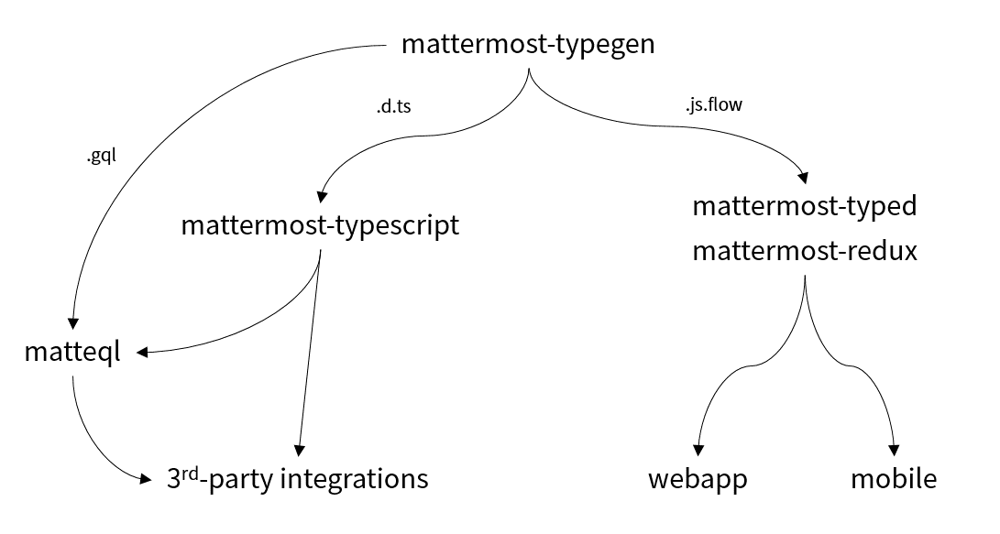

# mattermost-typegen
Typing generator for Mattermost

## What & Why

It's part of a plan to provide strong typings to Mattermost integrations.

Mattermost already typed by Go, but not clients and integrations.

I had started [mattermost-typed](https://github.com/cometkim/mattermost-typed) to support types also in clients and integrations, but there are problems:

- mattermost-redux mostly targets on browsers, but it is not fit to server-like integrations
- It was difficult to keep a huge amount of types **up-to-date**.
- Flow is effective for functional programming like redux codebase. However, community support is much better with TypeScript.
- I need to **do all this again**, If I need types in different ways like TypeScript and GraphQL

## How this works

TODO

I found out that Go already provides libraries([parser](https://golang.org/pkg/go/parser/), [AST](https://golang.org/pkg/go/ast/)) for parsing itself. Also [template](https://golang.org/pkg/text/template/)! 
